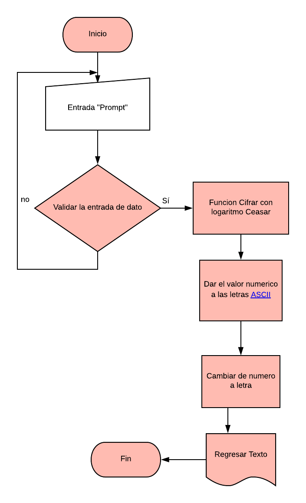
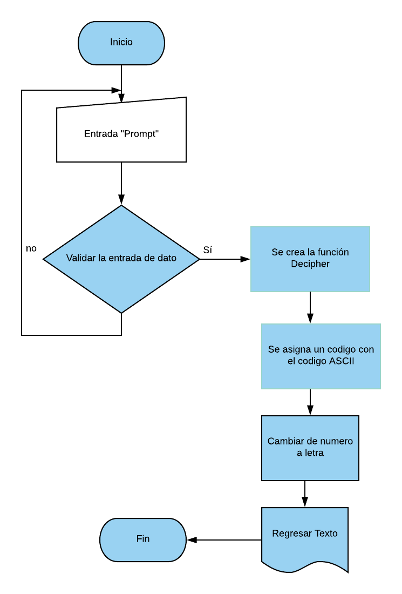

# Cifrado Caesar

-El problema se basa en tratar de `cifrar` y `descifrar` a travez de en criptografía o también conocido como cifrado por desplazamiento, código de César.
 ejemplo

 | Texto original       | Texto codificado|
 | -------------        |:-------------:|
 | ABCDEFGHIJKLMNÑOPQRSTUVWXYZ|   GHIJKLMNOPQRSTÑUVWXYZABCDEF |

## Codigo ASCII
El código ASCII significa en español Código Estadounidense Estándar para el Intercambio de Información, este código está basado integralmente en el alfabeto latino, se tomara en cuenta A-Z (65-90) y a-z(97-122) para poder cifrar el texto.

 # Instrucciones
 Mediante un "Prompt" se invita al usuario a ingresar un texto valido (String a-z, A-Z) para la ejecucion del programa; el campo no puede estar vacio ni contener caracteres numerico.
 >Tu programa debe ser capaz de cifrar y descifrar tanto letras mayúsculas como minúsculas. La fórmula para descifrar es: (x >- n) % 26
 Quote break.

 EL código debe estar compuesto por 2 funciones con los siguientes nombres: cipher y decipher.
## Pasos a seguir funcion Cipher
1. Crear una funcion **Cipher**.
2. El texto sera modificado con el metodo *charCodeAt()*  tomando un número indicando el valor Unicode del carácter en el índice proporcionado, `ASCII`.
3. Si el codigo es un caracter en blanco se dejara sin cifrar.
4. Se usara *fromCharCode()* para regresar el texto con el codigo `ASCII`.
5. formula para cifrar: (x - 65 + n)%26 + 65

## Pasos a seguir funcion Decipherm
1. Crear una funcion **Decipher**.
2. El codigo sera modificado con el metodo *charCodeAt*
3. Se asigna un codigo de acuerdo a nuestra tabla en ASCII
4. Si el código es de carácter espacio, se deja sin cifrar.
5. Se usara *fromCharCode()* para regresar el texto con el codigo `ASCII`.
6. Se usa la formula para descifrar: (x + n) % 26

